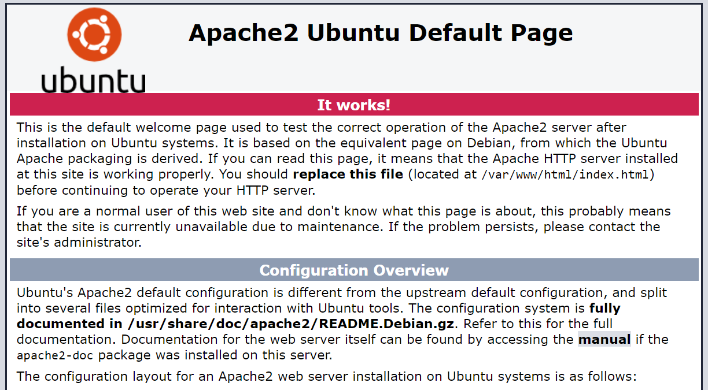
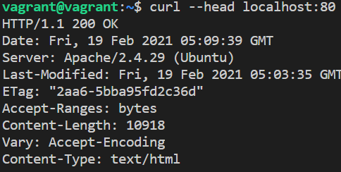

# Laboratorio - Introducción a Vagrant

Vagrant es una herramienta que permite abstraer la configuración de máquinas 
virtuales utilizando un lenguaje declarativo para definir la configuración y 
permite la desacoplacion de la definición de la máquina virtual y su entorno de
ejecución: virtualbox, hyper-v, vmware, docker, etc.

Además permite automatizar la preparación del entorno de la máquina virtual, 
por ejemplo, al crear la máquina virtual puede automáticamente ejecutar un
script que instale el software necesario. Esto permite compartir entornos 
reproducibles en diferentes máquinas entre distintas personas.

## Prerequisitos

* Mac OS/Linux/Windows con Virtualbox y su extension pack instalado
* Bash o PowerShell

## Práctica

Para la práctica se asumirá una máquina de Windows con PowerShell instalado.

### Instalando Vagrant

Visita el sitio de [descarga de Vagrant](https://www.vagrantup.com/downloads) y
sigue los pasos de insetalación.

Una vez instalado, abre Powershell y ejecuta el comando `vagrant version`. El
resultado debería ser similar a este:

```
Installed Version: 2.2.14
Latest Version: 2.2.14

You're running an up-to-date version of Vagrant!
```

### Utilizando vagrant

Vagrant utiliza un archivo de configuración que permite replicar la máquina 
virtual entre usuarios. Para este laboratorio descarga y descomprime el 
contenido de [este repositorio](https://github.com/javiertoledos/lab-vagrant/archive/master.zip). 
En él encontraras un archivo llamado `Vagrantfile` con el siguiente contenido:

```ruby
Vagrant.configure("2") do |config|
  # Define la imagen base que se usara para configurar la maquina virtual
  # En este caso es una imagen de ubuntu modificada para Vagrant
  config.vm.box = "hashicorp/bionic64"

  # Permite redireccionar un puerto del host a la maquina virtual
  config.vm.network "forwarded_port", guest: 80, host: 8080, host_ip: "127.0.0.1"

  # Al provisionar la maquina ejecuta este script lo que permite instalar apps
  config.vm.provision "shell", inline: <<-SHELL
    apt-get update
    apt-get install -y apache2
  SHELL
end
```

Para ejecutar esta definición de máquina virtual, ingresa al folder 
descomprimido y ejecuta:

```
vagrant up --provision
```

Este comando iniciará y provisionará con el script de `shell` dicha máquina 
virtual lo que instalará un servidor web de Apache. Gracias al forwarding de 
puertos el servidor será accesible desde la máquina física ingresando en el 
explorador a la dirección http://127.0.0.1:8080. Lo que debería mostrar una
página similar a esta:



Uno puede ingresar a la máquina virtual via ssh utilizando el comando 

```
vagrant ssh
```

Podemos corroborar que desde la máquina virtual el puerto donde se está 
ejecutando el sitio es el 80, con el siguiente comando dentro de la maquina:

```
curl --head localhost:80
```

El resultado de este comando debería ser similar a este:



## Ejercicios

1. Cambia el script de shell dentro del Vagrantfile para que en vez de instalar
  apache instale un servidor de nginx (es probable que debas ejecutar 
  `vagrant destroy` para no conservar la instalación de apache previa y utilizar
  una máquina limpia)
2. Configura el forwarding de puertos para que en vez de utilizarse el puerto 
  8000, utilice un puerto aleatorio que elijas entre el 9000 y 9999.
3. Dentro de la carpeta del laboratorio, se encuentra un folder llamado html con
  una página html dentro. Investiga como sincronizar esta carpeta con la carpeta
  del servidor web `/var/www/html` de forma que al iniciar la máquina virtual
  muestre la página que se encuentra dentro del folder del laboratorio y no la
  que viene por defecto con el servidor web. Al cargar el sitio debe lucir 
  similar a esto:
  

## Entrega

1. Crea un archivo llamado respuestas.txt y responde las siguientes preguntas:
  - Url para ver el sitio desde la máquina host
  - ¿Qué ventajas ofrece definir una máquina virtual como código en vez de un
    archivo de virtualización OVF u OVA?
  - ¿Cómo podría exponer en una red pública (bridge) mi máquina virtual de 
    Vagrant utilizando el archivo de configuración?
2. Crea un archivo zip con el nombre `lab-vagrant-<numero de carne>.zip`. Es
  requerido respetar este nombre ya que se evaluará con una herramienta
  automática el laboratorio y en caso de no seguir instrucciones, no se evaluará
  la respuesta.
3. En el archivo zip se debe colocar el contenido modificado que se descargó al
  inicio de la práctica. Los archivos y folders que se deben incluir son:
    - Vagrantfile
    - html
    - respuestas.txt

    Archivos a excluir:
    - .vagrant
    - README.MD
    - images

    Es importante que el archivo .zip tenga la misma estructura de directorios y
    el laboratorio no esté dentro de un folder en el archivo zip:

    **Correcto:**
    ```
    lab-vagrant-20072089.zip
    ├── Vagrantfile
    ├── respuestas.txt
    └── html
        └── index.html
    ```
    **Incorrecto:**
    ```
    laboratorio.zip
    └──master
        ├── .vagrant
        ├── Vagrantfile
        ├── respuestas.txt
        └── html
            └── index.html
    ```
